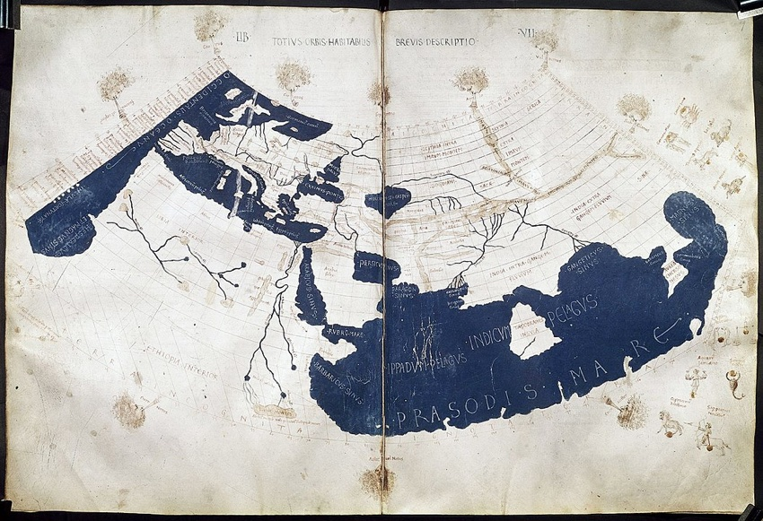
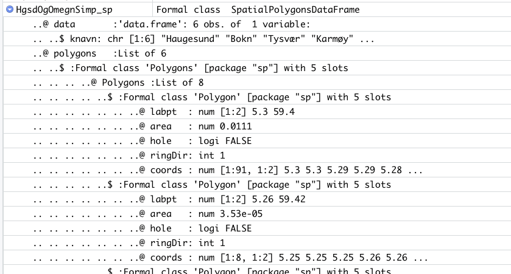

```{r setup, include=FALSE}
options(htmltools.dir.version = FALSE)
knitr::opts_chunk$set(
  fig.width=9, fig.height=3.5, fig.retina=3,
  out.width = "100%",
  cache = FALSE,
  echo = TRUE,
  message = FALSE, 
  warning = FALSE,
  fig.show = TRUE,
  hiline = TRUE
)
suppressPackageStartupMessages({
  library(tidyverse)
  library(RefManageR)
  library(xaringan)
  library(xaringanthemer)
  library(xaringanExtra)
  library(ggplot2)
  library(maps)
  library(mapproj)
  library(tmap)
  library(rmapshaper)
  library(sf)
  library(spData)
  library(spDataLarge)
  library(stars)
  library(mapview)
  library(rgdal)
  library(rgeos)
  library(rnaturalearth)
  library(rnaturalearthhires)
  library(plotly)
  library(imageclipr)
  library(units)
})
```

```{r xaringan-themer, include=FALSE, warning=FALSE}
style_duo_accent(
  primary_color = "#054356",
  secondary_color = "#1bafb9",
  inverse_header_color = "#f9de45"
)
```

```{r hvl-logo, echo=FALSE}
xaringanExtra::use_logo(
  image_url = "hvl_logo_engelsk.jpg",
  width = "165px",
  height = "192px"
)
xaringanExtra::use_tile_view()
xaringanExtra::use_panelset()
```

```{r, load_refs, include=FALSE, cache=FALSE}
BibOptions(check.entries = FALSE,
           bib.style = "authoryear",
           cite.style = "alphabetic",
           style = "markdown",
           hyperlink = FALSE,
           dashed = FALSE)
myBib <- ReadBib("../met2refs.bib", check = FALSE)
```


## Our first map

.panelset[
.panel[.panel-name[Code]

```{r, eval=FALSE}
HgsdOgOmegn <- read_sf("HgsdOgOmegn.gpkg")
HgsdOgOmegn %>% 
  select(knavn) %>% 
  plot(graticule = TRUE, axes = TRUE, key.pos = 1)
```

- We read in a map with `read_sf()`, `select()` the variable __knavn__ and then `plot()` the map. Notice that `plot()` knows how to plot a map!
- When package sf is loaded there exists a function `plot.sf()` that knows how to plot maps. See `?plot.sf` for details.
- The generic `plot()` function calls the right function for the relevant kind of object.
- Mapdata originally from [geonorge](https://kartkatalog.geonorge.no/metadata/administrative-enheter-historiske-versjoner/9bc064e3-6c34-4c3a-8421-00290052e9c0)
]

.panel[.panel-name[Plot]

```{r, echo=FALSE}
HgsdOgOmegn <- read_sf("HgsdOgOmegn.gpkg")
HgsdOgOmegn %>% 
  select(knavn) %>% 
  plot(graticule = TRUE, axes = TRUE, key.pos = 1)
```
]
]

---

## Our first map cont. (mapview)

- Same map using `mapview()` (java script). From the package `mapview`. Nice for interactive use, perhaps not as well suited for print.

--

- See `?mapview` and section __## S4 method for signature 'sf'__ for details. `Mapview()` can also handle other kinds of map objects.

---

## Our first map cont. (mapview)

.panelset[
.panel[.panel-name[Code]

```{r, eval=FALSE}
HgsdOgOmegn %>% 
  select(knavn) %>% 
  mapview(legend = TRUE, col.regions = sf.colors)
```
]

.panel[.panel-name[Plot]
```{r, echo=FALSE}
HgsdOgOmegn %>% 
  select(knavn) %>% 
  mapview(legend = TRUE, col.regions = sf.colors)
```
]
]

---

## Vector to raster

- We can easily convert from vector to raster (the reverse is more complicated).

--

- Bitmap, pixels, an image. 

--

- `HgsdOgOmegn` was in vector format (i.e. a drawing). Points, with lines drawn between the points, and a __fill__ inside a closed polygon.

```{r, eval=FALSE}
HgsdOgOmegn %>% 
  select(knavn) %>% 
  st_rasterize(dx = 0.001) %>% #<<
  plot(col=sf.colors(6), breaks = c(0:6))
```

---

## Vector to raster cont.

```{r, echo=FALSE, cache=TRUE}
HgsdOgOmegn %>% 
  select(knavn) %>%
  st_rasterize(dx = 0.001) %>% 
  plot(col=sf.colors(6), breaks = c(0:6))
```

---

## Mapping with ggplot

We know ggplot from before and it produces nice maps (although perhaps a bit slowly). Later we will also use the package. __tmap__

```{r, eval=FALSE}
HgsdOgOmegn %>% 
  ggplot() + 
  geom_sf(aes(fill = knavn)) #<<
```

---

## Mapping with ggplot cont.

```{r, echo=FALSE, cache=TRUE}
HgsdOgOmegn %>% 
  ggplot() + 
  geom_sf(aes(fill = knavn)) 
```

---

## Perhaps to much detail?

- We can find the size of the object HgsdOgOmegn with `round(object.size(HgsdOgOmegn) / 1024)`: `r round(object.size(HgsdOgOmegn) / 1024)`

--

- `sf` has `st_simplify()` with option preserveTopology = TRUE, `HgsdOgOmegnSimp <- st_simplify(HgsdOgOmegn, preserveTopology = TRUE, dTolerance = 1000)`

--

- `st_simplify()` preserves topology for each feature (polygon), but not between features (polygons).

--

- `ms_simplyfy()` from the __rmapshaper__ package preserves topology between features and is a better alternative.

---

## Simplified map

.panelset[
.panel[.panel-name[Code]

```{r, eval=FALSE}
HgsdOgOmegnSimp <- HgsdOgOmegn %>% 
  select(knavn) %>% 
  # keep_shapes = TRUE else we risk to loose islands
  # keep 5% of the points
  ms_simplify(keep = 0.05, keep_shapes = TRUE) #<<
 
round(object.size(HgsdOgOmegn) / 1024)
round(object.size(HgsdOgOmegnSimp) / 1024)

HgsdOgOmegnSimp %>% 
  ggplot() + 
  geom_sf(aes(fill = knavn))
```
]

.panel[.panel-name[Plot]
```{r, echo=FALSE, cache=TRUE}
HgsdOgOmegnSimp <- HgsdOgOmegn %>% 
  select(knavn) %>% 
  # keep_shapes = TRUE else we risk loosing islands
  ms_simplify(keep = 0.05, keep_shapes = TRUE)

HgsdOgOmegnSimp %>% 
  ggplot() + 
  geom_sf(aes(fill = knavn))
```
]
]

---

## Looking better and much smaller


.panelset[
.panel[.panel-name[Code]

```{r, eval=FALSE}
#size HgsdOgOmegn
round(object.size(HgsdOgOmegn) / 1024)
#size HgsdOgOmegnSimp
round(object.size(HgsdOgOmegnSimp) / 1024)
```
]

.panel[.panel-name[Results]
```{r, echo=FALSE}
#size HgsdOgOmegn
round(object.size(HgsdOgOmegn) / 1024)
#size HgsdOgOmegnSimp
round(object.size(HgsdOgOmegnSimp) / 1024)
```
]
]

---

## The problem with projections

[Projections illustrated](https://youtu.be/kIID5FDi2JQ)

---

## Geographical coordinates

--

- Haugesund (wikipedia.org): 59°24′37″N 5°16′32″Ø?

--

- This is degrees, minutes and seconds. The map uses decimal degrees.

--

- Shows the position of Haugesund on the globe, in degrees, minutes and seconds

--

- Old idea traceable back to Eratosthenes of Cyrene (276 - 194 BC), Hipparchus of Nicaea (190 - 120 BC), Marinus of Tyre (70 - 130 AD) and finally Claudius Ptolemy (100-170 AD) _Geographia_. _Geographia_ survived in arabic translation and was translated into latin 1406 (_Geographia Claudii Ptolemaei_). 

--

- The first degree is __latitude__, measured north (N) from equator

--

- The second degree is __longitude__, east (E) from the zero meridian (through Greenwich, just east of London). 

---

## Geographical coordinates cont.


- The position is given in the format geographers prefer, (latitude, longitude)

--

- Programmers/data scientist went for (x,y), hence (longitude, latitude)

--

- Still the source of much confusion

--

- Note that geographical coordinates on paper or screen are also a kind of projection. (Think of a photo of a globe)

--

- Note that the axis have coordinates in decimal degrees (not minutes and seconds)

---

.left-column[

## Ptolemy world map


]
.right-column[



]
---

## Maps in Europe between Ptolemy and the Renaissance?

.pull-left-40[
- T and O maps
- Jerusalem center, Asia up, Europe lower left, Africa lower right
- Hereford mappa mundi, ca. 1300 (from wikipedi.org)
]

.pull-right-60[
.center[

]
]
---

## Haugesund

.pull-left-40[
- Haugesund (wikipedia.org): 59°24′37″N 5°16′32″Ø

.small[
```{r, eval=FALSE}
HgsdOgOmegnSimp %>% 
  filter(knavn=='Haugesund') %>% 
  ggplot() + 
  geom_sf(aes(fill = knavn)) +
  geom_point(aes(x=5.275, y=59.410))
```

```{r}
# covert minutes and seconds to decimal degree
(24*60 + 37)/(60*60)
(16*60 + 32)/(60*60)
```

]
]
.pull-right-60[
```{r, echo=FALSE}
HgsdOgOmegnSimp %>% 
  filter(knavn=='Haugesund') %>% 
  ggplot() + 
  geom_sf(aes(fill = knavn)) +
  theme(legend.position="none") +
  geom_point(aes(x=5.275, y=59.410))
```
]
---

## What is "inside" HgsdOgOmegnSimp?

.small[
```{r}
HgsdOgOmegnSimp
```
]

---

## What is "inside" HgsdOgOmegnSimp? cont.

- That was quite clean

--

- Utilises the new list-column technique

--

- The geographical information is in the last column

--

- The geom column is persistent, we have to actively delete it

--

- We drop the geometry with `st_set_geometyr(NULL)` or `st_drop_geometry`. Then we will be left with a plain tibble/dataframe. 

---

## What is WGS84?

- EPSG:4326 WGS 84 -- WGS84 - World Geodetic System 1984
- Model of the whole planet, used with GPS
- geographical coordinates (eastings, northings etc.)
  - "71° Nord"

From wikipidia.org:

> The World Geodetic System (WGS) is a standard for use in cartography, geodesy, and satellite navigation 
> including GPS. This standard includes the definition of the coordinate system's fundamental and 
> derived constants, the ellipsoidal (normal) Earth Gravitational Model (EGM), a description of the 
> associated World Magnetic Model (WMM), and a current list of local datum transformations.

---

## What is MULTIPOLYGON?

- MULTIPOLYGON is an example of a __simple feature__

--

> Simple Features (officially Simple Feature Access) is a set of standards that specify a common storage 
> and access model of geographic feature made of mostly two-dimensional geometries (point, line, polygon, 
> multi-point, multi-line, etc.) used by geographic information systems. It is formalized by both the 
> Open Geospatial Consortium (OGC) and the International Organization for Standardization (ISO). 
(wikipedia.org)

- __simple__: A 2D geometry is simple if it contains no self-intersection

--

- Supported by __sf__, not by __sp__, postgis (PostgreSQL extension), SpatiaLite (SQLite extension), GDAL etc.

--

Simple features standard did not exist when __sp__ was designed.

---

## HgsdOgOmegnSimp as SpatialPolygonsDataframe

```{r}
HgsdOgOmegnSimp_sp <- HgsdOgOmegnSimp %>% 
  as_Spatial()
```

---

## From environment tab



- This is just the top

## References

```{r results = "asis", echo = FALSE}
PrintBibliography(myBib, .opts = list(check.entries = FALSE, sorting = "ynt"))
```


```{r}
#siste
```

